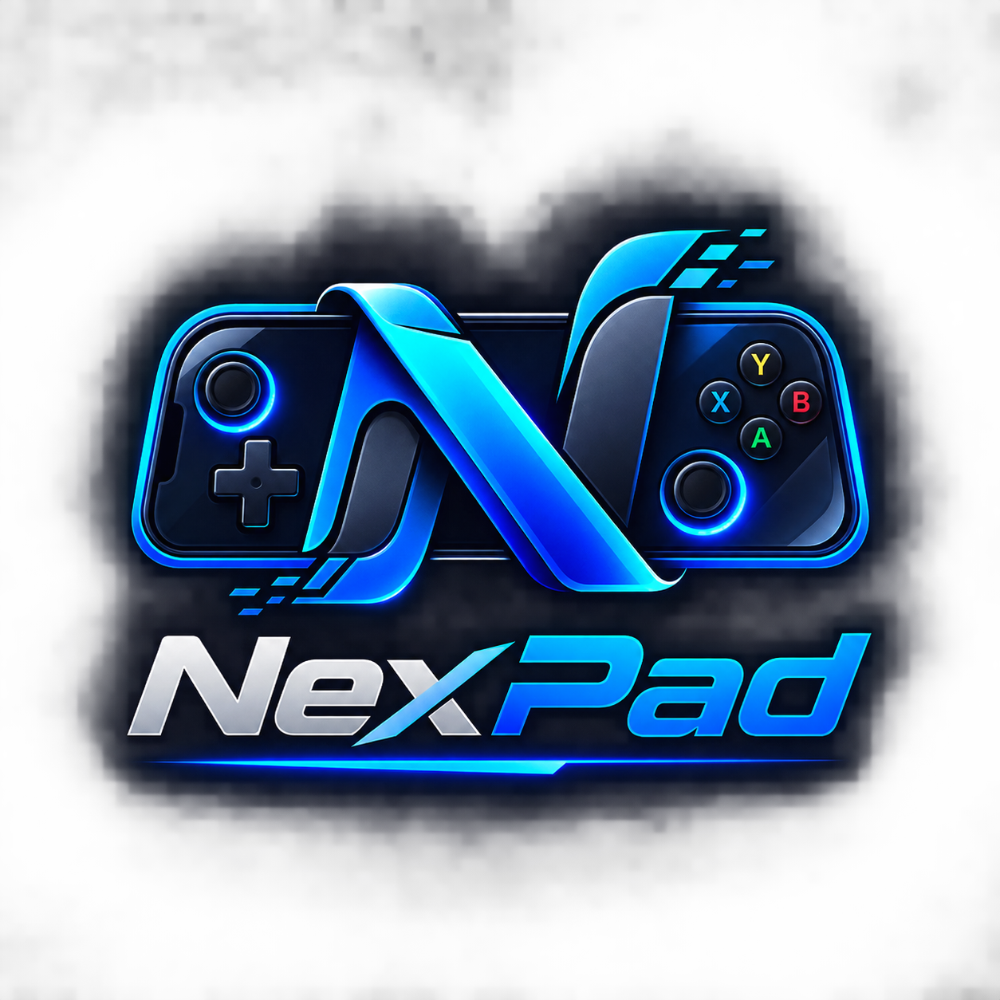

# 🎮 NexPad — Ultra-Low Latency Virtual Gamepad & Racing Wheel for PC

  

  <b>Turn your Android phone into an ultra-low latency (<3ms) Xbox 360 Controller & Racing Wheel for PC gaming.</b>

  
  
  
  
  

---

## 📥 Downloads (Latest Release v1.1.0)

| Package | Description | Direct Download |
| :--- | :--- | :--- |
| **🚀 NexPad Windows Installer** | **Recommended.** 1-Click setup with ViGEmBus drivers, server, APK & uninstaller embedded. | [**Download `NexPad_Setup.exe`**](https://github.com/SushantSaks/NexPad/releases/latest/download/NexPad_Setup.exe) *(17.3 MB)* |
| **📱 NexPad Android App** | Dedicated Android APK with 100 Hz UDP, customizable layouts, 6 themes & multiplayer badge. | [**Download `NexPad.apk`**](https://github.com/SushantSaks/NexPad/releases/latest/download/NexPad.apk) *(7.19 MB)* |
| **📦 NexPad Portable** | Standalone zip containing Windows server and Android APK without installer. | [**Download `NexPad_Portable.zip`**](https://github.com/SushantSaks/NexPad/releases/latest/download/NexPad_Portable.zip) *(17.3 MB)* |

---

## ✨ Features

### 👥 1. Up to 4-Player Simultaneous Multiplayer
* Connect up to **4 Android phones simultaneously** to a single PC server over Wi-Fi or PC Mobile Hotspot.
* Windows recognizes each phone as a distinct **Xbox 360 Controller (Player 1, Player 2, Player 3, Player 4)**.
* Dynamic plug & play: Windows only registers controllers when phones connect, and cleanly unplugs them when phones disconnect.
* Perfect for local co-op & split-screen games: **FIFA / EA FC, Rocket League, Overcooked, It Takes Two, Blur, Gang Beasts, and emulators**.

### 🏎️ 2. Dedicated Driving & Racing Wheel Layout
* **Virtual Steering Wheel**: Natural angular touch rotation with realistic spring return-to-center physics.
* **Customizable Steering Range**: Adjust lock-to-lock rotation from **±45° up to ±720° (2 full turns)** with quick presets (`±45°`, `±90° F1`, `±180° GT3`, `±270° Rally`, `±360°`, `±540° Drift`, `±720° Pro Sim`).
* **Analog Racing Pedals**:
  * **Accelerator Pedal (`GAS / RT`)**: Progressive analog throttle with live percentage display (`0% - 100%`).
  * **Brake Pedal (`BRAKE / LT`)**: Heavy-duty progressive braking with live percentage display.
* **Tactical Racing Controls**: Dedicated **`E-BRAKE (A)`** drifting button, **`⚡ BOOST (B)`**, paddle shifters (`LB / RB`), and auxiliary view controls.

### 🎮 3. Full Standard Gamepad (Xbox 360 / XInput)
* Dual analog thumbsticks (`LS`, `RS`) with customizable deadzones and sensitivity.
* Tactile action buttons (`A`, `B`, `X`, `Y`), unified D-Pad, bumpers (`LB`, `RB`), analog triggers (`LT`, `RT`), click sticks (`L3`, `R3`), and system buttons (`VIEW`, `MENU`, `GUIDE`).
* Works natively with **Steam, Xbox Game Pass, Epic Games Store, EA Play, Ubisoft Connect, RPCS3, PCSX2, Dolphin, Yuzu, Ryujinx, and Cemu**.

### ✏️ 4. Full Layout Customizer (Edit Mode)
* Drag and move any button anywhere on screen.
* Resize individual controls from **0.60x to 2.00x**.
* Grid snapping (`Snap: ON/OFF`), undo / redo stack (up to 25 steps), and reset to default.
* Save custom configurations to **User Presets** for different genres (FPS, Racing, RPG, Fighting).

### 🎨 5. 6 Dynamic Hardware Themes
* **Cyber Cyan**: Neon cyan accents with dark obsidian backing.
* **Stealth Black**: Matte blackout aesthetics with tactical carbon styling.
* **DualSense Slate**: PlayStation glyphs (`✕`, `○`, `□`, `△`) on premium slate.
* **Xbox Emerald**: Iconic green accents with authentic Xbox button colorways.
* **Synthwave Neon**: Hot pink & retro purple 80s aesthetics.
* **Crimson Viper**: Blood-red racing cockpit theme.

### ⚡ 6. Ultra-Low Latency & Auto-Discovery
* Direct **100 Hz UDP transmission** with sub-3ms latency.
* **Auto-Discovery**: Open the app and connect to your PC in less than 1 second.
* **Auto Windows Mobile Hotspot**: Server automatically turns on your PC Hotspot if Wi-Fi is off for direct 1ms latency.

---

## 🚀 Quick Start Guide

### Step 1: Install on PC
1. Download and run [**`NexPad_Setup.exe`**](https://github.com/SushantSaks/NexPad/releases/latest/download/NexPad_Setup.exe).
2. The installer will automatically install the ViGEmBus controller driver (if missing) and create desktop shortcuts.
3. Launch **NexPad** from your Desktop.

### Step 2: Install on Android Phone
1. Connect your phone to the same Wi-Fi network or your PC's Mobile Hotspot.
2. Install [**`NexPad.apk`**](https://github.com/SushantSaks/NexPad/releases/latest/download/NexPad.apk) on your phone.
   *(You can also download it directly by opening your phone's browser and visiting `http://<your-pc-ip>:42426/NexPad.apk`)*.
3. Open **NexPad** on your phone and tap **"Connect"**.
4. *(Optional)* For multiplayer, have your friends connect their phones to the same Wi-Fi/Hotspot to join as **Player 2, 3, or 4**!

---

## 🛠️ System Requirements

* **PC**: Windows 10 (1903+) or Windows 11 (64-bit).
* **Phone**: Android 8.0 (Oreo) or newer.
* **Network**: Same Wi-Fi network or PC Mobile Hotspot (Recommended for lowest latency).

---

## 🛡️ License & Credits

* **Developer & Publisher**: Sushant
* **Controller Emulation**: Powered by [ViGEmBus](https://github.com/nefarius/ViGEmBus)
* © 2026 Sushant. All rights reserved.
